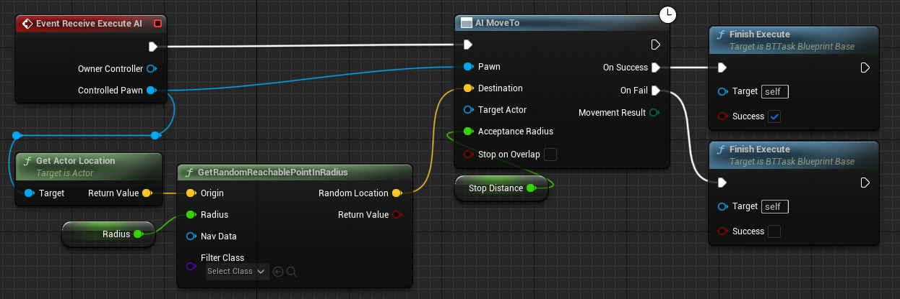

# Creating AI in Unreal Engine Full Process

There are a number of components required for a comprehensive AI system.

## Creation Steps

1. Blueprint for AI - Mesh, Materials, Blueprint - based on Pawn or character class, or child of player class but use AI Controller.
2. AI Controller
3. Behaviour Tree
4. Blackboard
5. Set AI Controller to run the behaviour tree from Event Begin Play > Run AI Behaviour Tree

The AI_Controller class contains a **Action Component** and a **Path Following Component** so it may come in handy to learn about those in more detail. One great source of information is **ALWAYS** the [Unreal Documentation](https://docs.unrealengine.com/5.2/en-US/artificial-intelligence-in-unreal-engine/).

### Roaming AI

This blueprint is for the Behaviour Tree Task of having the AI move to a random point within a customizable radius. **Radius** and **Stop Distance** were promoted to variables and are made editable from the outside.

# References

* [Ryan Layley's UE4 Third Person Shooter AI Tutorial](https://www.youtube.com/watch?v=DQqhJCoC4bQ&ab_channel=RyanLaley)
* [Creating Game Ready AI - God Game with Unreal Developers](https://www.youtube.com/live/PgxuaTSkyu4?feature=share)

