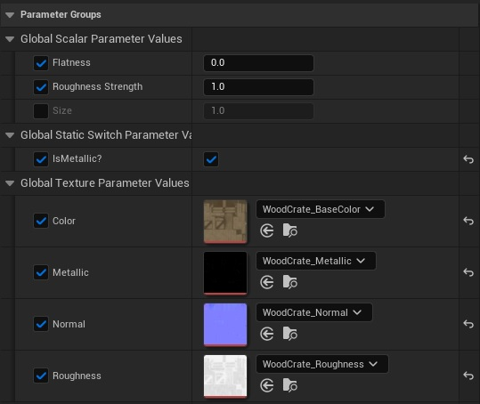
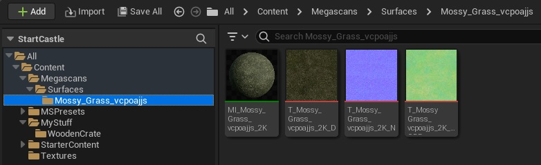

# Create a Master Material in Unreal Engine 5.1

This repo will explain how you can make a master material in Unreal Engine 5.1 in 2023 to take control of materials for your games or virtual worlds.

The use of a **Master Material** (superior material?) will allow you to quickly add and modify different parameters of a material using instances without having to go into the material graph editor.

To start, determine a material that you want to start with. This material would be made up of 3 textures:

* Base Color
* Normal
* Mask

The Mask file will simply be the third texture you see in any standard texture.

Use Megascans to find a texture you can use as a starting image. It can be any Surface texture. It will just be used to create a master template that can be used to create other textures much quicker in the future.

In this image, you can see a **material instance** for Mossy Grass from MegaScans. Beside it is the **base color** texture, the **normal** texture (the file name ends in N and the image is a fun purple-blue colour), and finally the pale green texture is the **mask** texture. 

The mask texture contains information divided into its Red, Green, and Blue channels. More on this [later].

After downloading and adding a texture from Megascans or other source:

1. In the Content Browser, create a new Material and name it **M_MasterMaterial**.
2. Open the **Material Graph** for the master material you just created by double-clicking its icon.
3. Use the Contnent Browser to find the three textures you will use for your material to start with. Drag the three textures for the material from the Content Browser into the M_MasterMaterial **Material Graph**.

### Resources

* [Unreal Sensei: Unreal Engine 5 Beginner Tutorial - UES Starter Course 2022](https://www.youtube.com/watch?v=k-zMkzmduqI)
