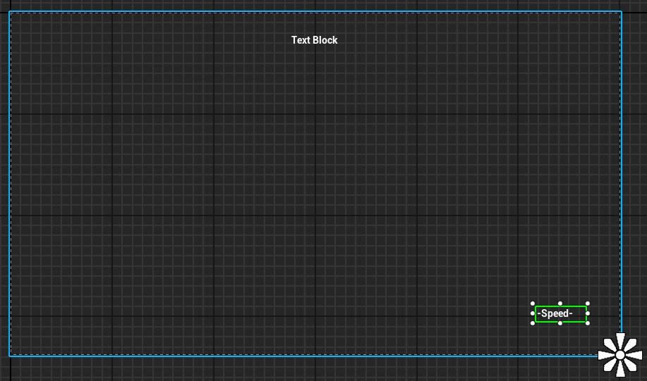

# HUD Widgets
For your heads-up-display (HUD) - or information you want to show on the screen - you will create UI Widgets.

* Create the widget by right-clicking in the Content Browser (create a UI folder in your project) and choose User Interface > Widget Blueprint.
* In this example we will display the character's speed in a text field on the HUD. Make sure <a href="https://github.com/rickhenderson/developing-in-unreal-engine/blob/main/character-movement-and-setup/README.md">Speed has already been set as a variable in your Animation Blueprint</a>.
* Double-click the widget blueprint to open it.
* In the menu on the left, type in "Canvas" and drag a Canvas Panel into the working area in the centre. This makes it much easier to control where your UI widgets are placed on a variety of screen sizes.
* Next, drag a text block onto the canvas where you want the speed to be displayed. You may have to remove the word "Canvas" from the search bar.

* In the image above, I have changed the default text of the speed text box, and added a second textbox to the top of the screen for other debugging.

* You can use the Anchors property of the text block to have more control over its location. More details on that later.
* To add the HUD to the player screen, one possiblity is to add it inside the Player Character blueprint.
* Open the player blueprint (ThirdPerson, FirstPerson, or your own) and find the **Event BeginPlay** node.
* Add the nodes **Create Widget** and **Add to Player Screen** as shown here. I've connected mine directly after the player mapping context gets set.
* You can use my nodes from [blueprintUE](https://blueprintue.com/blueprint/16-nr-ki/) and set the class to the Widget you created. In my example I called my widget WB_Speed, but WB_Main might be a better name.

## Example Videos

* [Set Up HUD & UI Widget by NiceShadow](https://www.youtube.com/watch?v=YCQ1heoaILY&t=40s&ab_channel=NiceShadow)